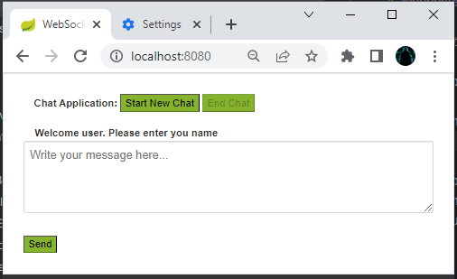
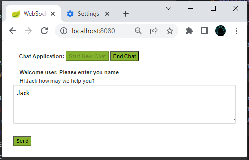
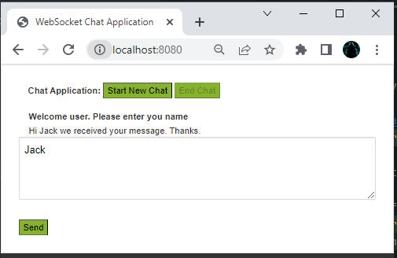

# Websocket Project

## Steps to execute

1. Run application locally by starting Application class

2. Open endpoint _http://localhost:8080/_ and you should be redirected to following page
   

3. Click on **_Start New Chat_**, and it will create websocket connection
4. Type in message and click on **_Send_**
5. It should return message from server websocket handler as below.
   
6. Click on **_End Chat_**, and it will end the websocket connection so no further messages will be sent even if you click on **_Send_** button.
   